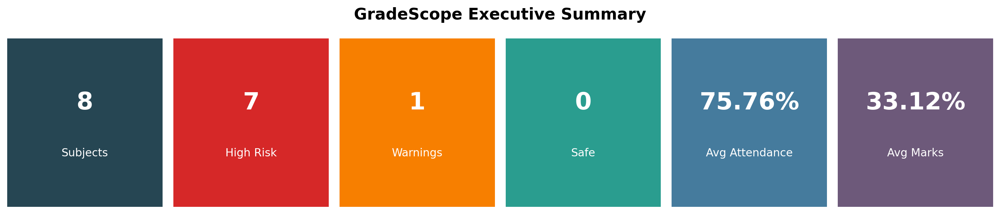
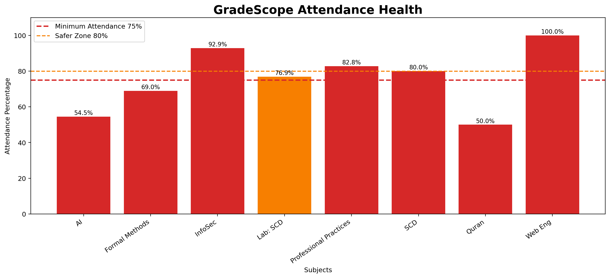
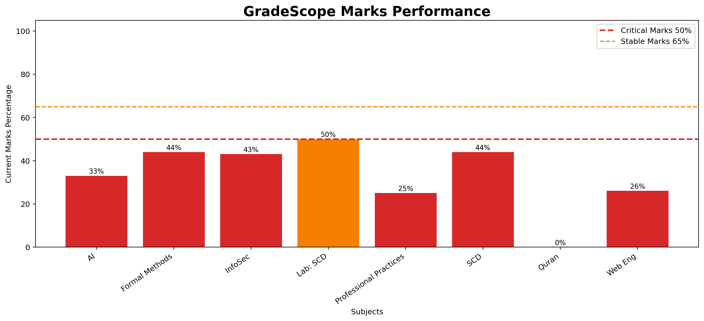
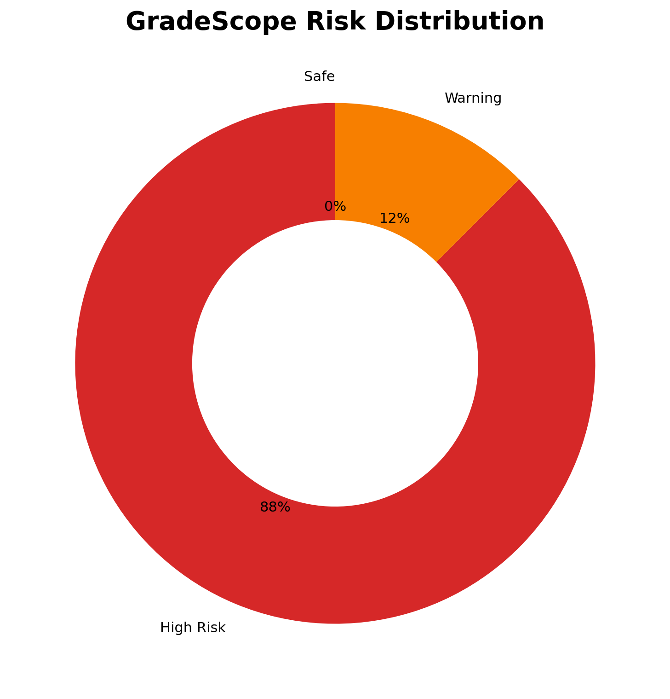
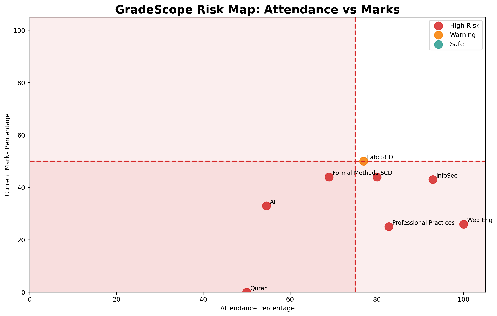

# GradeScope

GradeScope is a local academic dashboard for students who want a clearer view of their attendance, marks, and subject risk without digging through messy portal pages.

It opens ZABDesk in a real browser, lets the student log in manually, captures attendance and result pages, parses the data, and shows everything inside a clean Streamlit dashboard.

The project is designed to run locally. No passwords are stored. No portal credentials are required inside the code.

## Why I built this

Student portals usually show the data, but they do not explain what needs attention.

GradeScope focuses on the practical questions:

- Which subjects are below safe attendance?
- Which subjects are below passing marks?
- Which results are incomplete because final marks are not entered yet?
- Which subjects should be fixed first?

## Features

- Local Streamlit dashboard
- Manual ZABDesk login through Playwright
- Attendance page capture
- Result page capture
- HTML parsing with BeautifulSoup
- Raw scraped text view
- Attendance, absents, late count, quiz marks, assignment marks, mid marks, final marks, total marks, grade, and reason extraction
- Risk rules based on attendance and marks
- Live stat cards
- White-background charts
- Subject-level recommendations
- Clear local data tool
- Windows setup and launch scripts

## Risk rules

| Metric | Safe level | Risk condition |
|---|---:|---|
| Attendance | 80% or above | Below 80% |
| Marks | 55% or above | Below 55% |

## Screenshots

### Executive Summary



### Attendance Health



### Marks Performance



### Risk Distribution



### Risk Map



## How it works

1. Start the local app.
2. Open the portal sync page.
3. Log in to ZABDesk manually.
4. GradeScope detects the logged-in session.
5. It captures attendance and marks pages.
6. Parsers extract structured data from the captured HTML.
7. The merged dataset is shown in the dashboard.

## Quick start on Windows

### 1. Install dependencies

Double-click:

```text
setup.bat
```

This creates a virtual environment, installs the required Python packages, and installs the Playwright browser.

### 2. Start GradeScope

Double-click:

```text
start_gradescope.bat
```

This opens the local Streamlit app in the browser.

### 3. Sync portal data

Inside the app:

1. Open `Dashboard` from the sidebar.
2. Select `Portal Sync`.
3. Click `Start live portal sync`.
4. Log in when ZABDesk opens.
5. Wait for capture, parsing, and merge to finish.
6. Return to the dashboard.

## Manual setup

```bash
pip install -r requirements.txt
python -m playwright install
streamlit run app.py
```

## Project structure

```text
gradescope/
├── app.py
├── setup.bat
├── start_gradescope.bat
├── requirements.txt
├── README.md
├── SZABIST_Academic_Dashboard.ipynb
├── scraper.ipynb
├── scripts/
│   ├── portal_scraper.py
│   ├── parse_attendance.py
│   ├── parse_marks.py
│   └── merge_dashboard.py
├── data/
│   └── processed/
│       └── demo_gradescope_dashboard.csv
├── assets/
│   ├── charts/
│   └── reports/
│       └── gradescope_report.html
└── docs/
    ├── DATA_DICTIONARY.md
    └── PRIVACY_CHECKLIST.md
```

## Important files

| File | Purpose |
|---|---|
| `app.py` | Main Streamlit app |
| `setup.bat` | Windows setup script |
| `start_gradescope.bat` | Local app launcher |
| `scripts/portal_scraper.py` | Opens ZABDesk and captures portal pages |
| `scripts/parse_attendance.py` | Extracts attendance records |
| `scripts/parse_marks.py` | Extracts marks records |
| `scripts/merge_dashboard.py` | Creates the final dashboard dataset |
| `data/processed/demo_gradescope_dashboard.csv` | Public-safe demo dataset |
| `docs/DATA_DICTIONARY.md` | Dataset column reference |
| `docs/PRIVACY_CHECKLIST.md` | Safety checklist before publishing |

## Tech stack

- Python
- Streamlit
- Playwright
- BeautifulSoup
- Pandas
- NumPy
- Plotly
- Matplotlib
- Jupyter Notebook

## Privacy notes

GradeScope is meant to run locally.

Do not publish real portal data. Do not commit login credentials, screenshots, raw HTML captures, or private academic CSV files.

The public repo should only contain demo or sanitized data.

Private files and folders are ignored through `.gitignore`, including:

```text
.env
.venv/
data/raw/
data/summaries/
assets/screenshots/
real scraped dashboard CSV files
portal HTML files
portal text dumps
```

## Current status

GradeScope is a working local academic dashboard. It can open the portal, capture pages, parse attendance and marks, merge the results, show a dashboard, display raw sync notes, and clear local data when needed.

## Possible improvements

- PDF report export
- Better mobile layout
- Streamlit Cloud demo mode using fake data
- Grade prediction
- Weekly reminder system
- Course priority planner

## Disclaimer

This project is for personal academic tracking and portfolio demonstration. Use it responsibly and keep private student data local.